# Coach Analysis: 网球 — 2026-03-19

## Background

> 这是一段网球训练视频。请全程用中文进行专业网球教练分析。重点分析方向：综合评估（击球技术 + 步法 + 身体旋转）。请从以下维度给出详细点评：- 击球技术：引拍时机、接触点、髋肩旋转、随挥完整性 - 步法：分步时机、移动方式、击球后复位 - 身体姿态：平衡、重心转移、核心稳定性 - 每个问题注明出现在哪一帧，给出具体修正建议。

## Key Frames

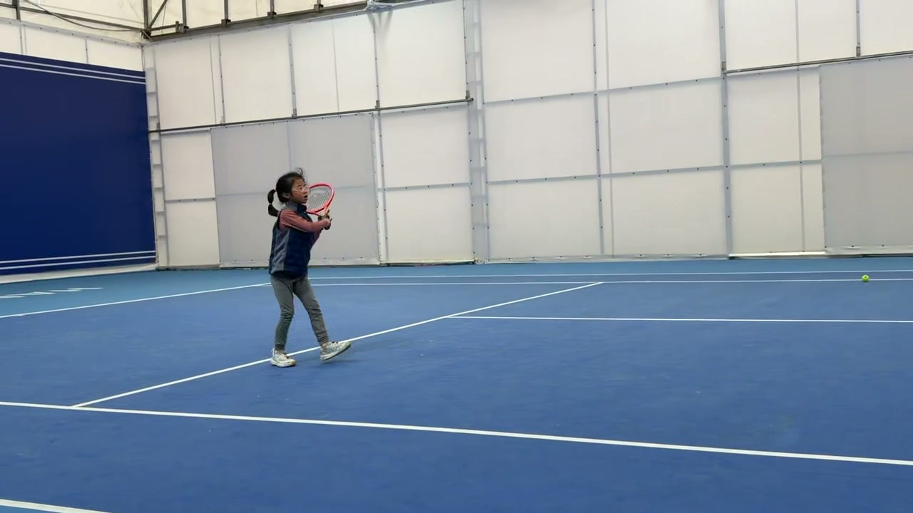
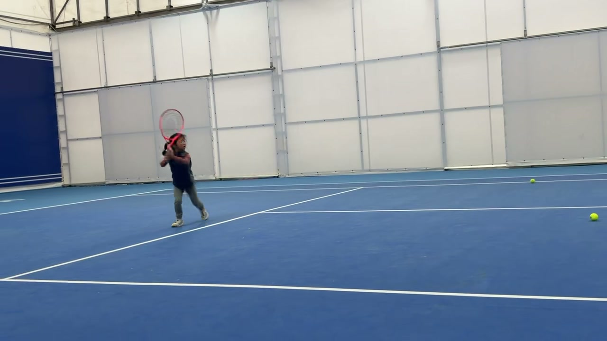
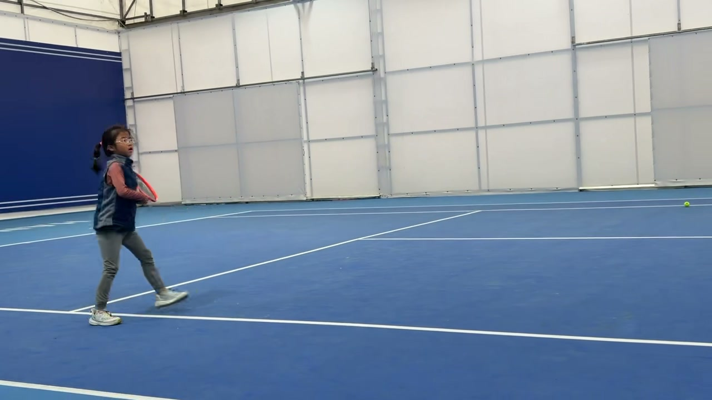
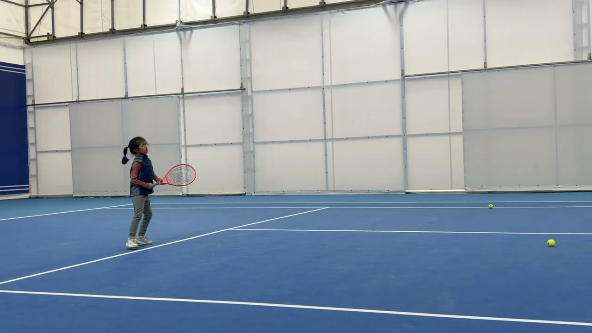
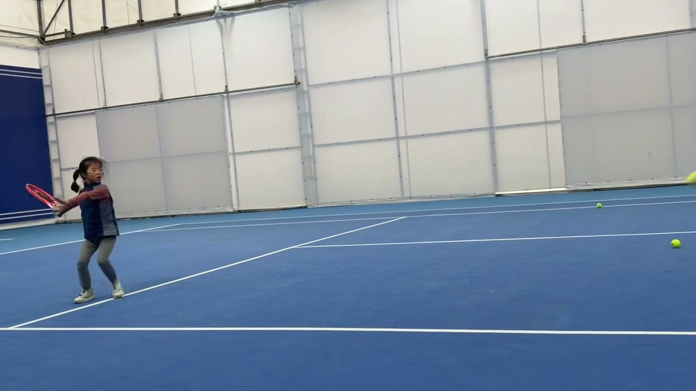
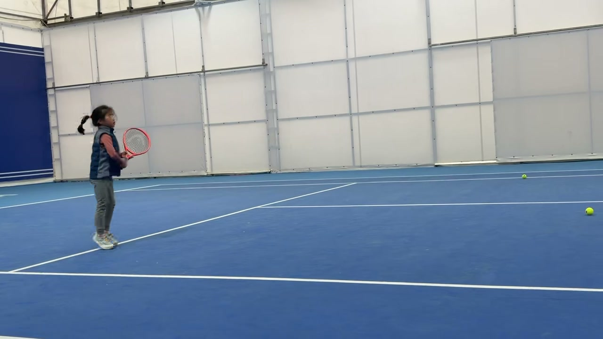
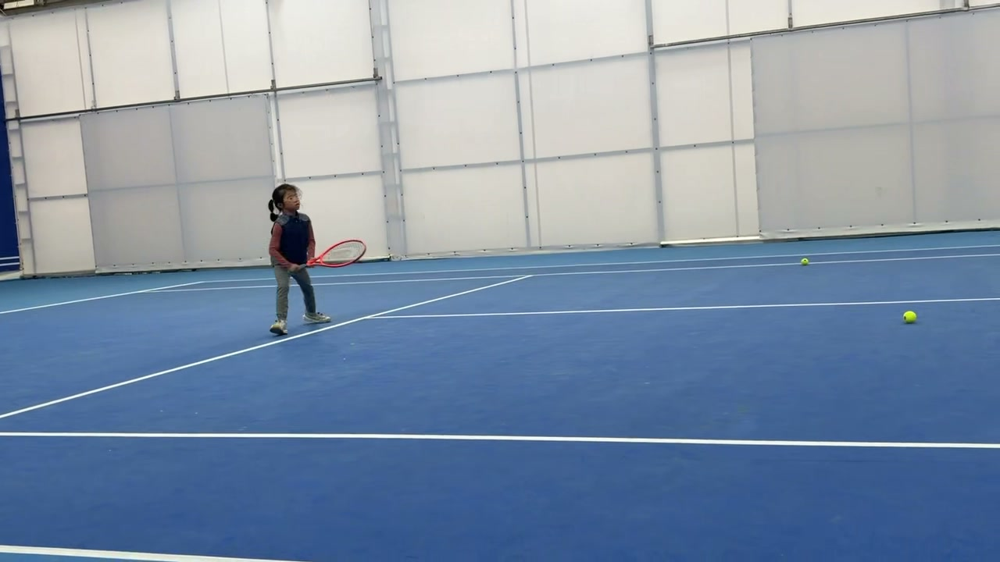
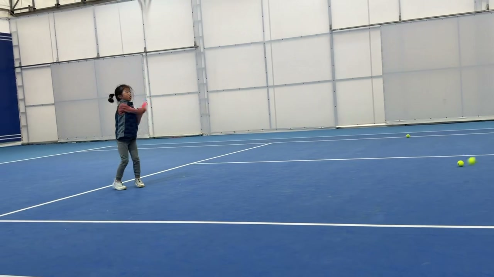
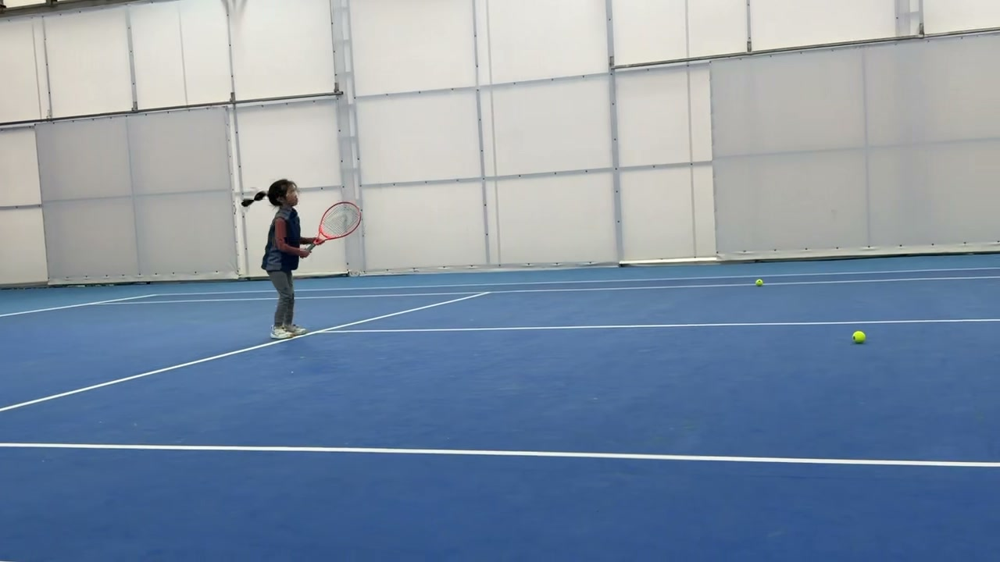
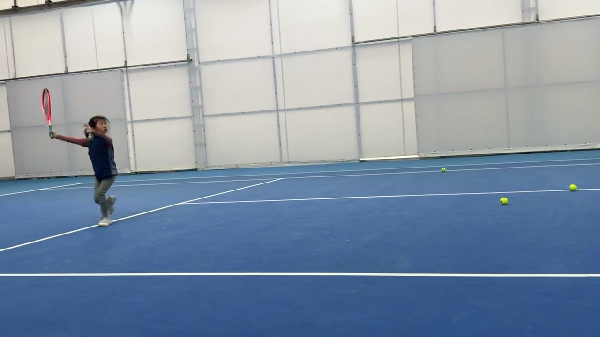
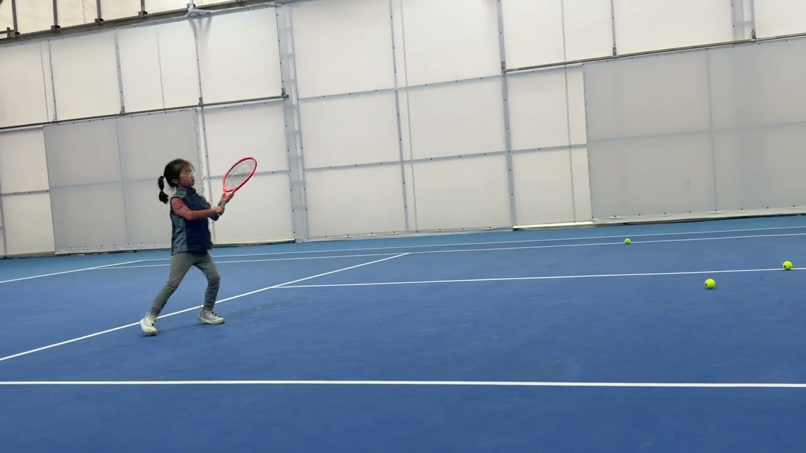
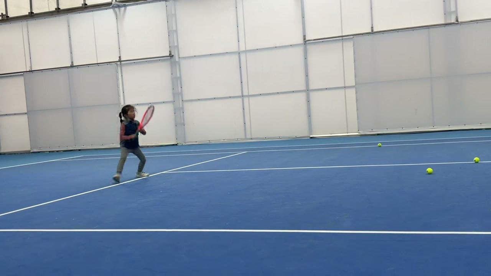

## Analysis

### Overall Score: 6/10

## Strengths

- 引拍时机较好（Frame 1, Frame 2）
- 保持了不错的重心平衡（Frame 3, Frame 6）
- 击球后有基本的恢复（Frame 8, Frame 12）

## Issues Found

- 髋肩旋转不足，影响击球力量（Frame 5）
- 击球点未在身体的最佳位置（Frame 6）
- 随挥动作不够完整且自然（Frame 10）
- 步法移动较慢，准备不充分（Frame 11）

## Improvement Suggestions

1. 加强髋肩旋转练习，可以增加训练中的模拟转体动作
2. 调整击球点，让球拍在身体稍前方接触球
3. 练习完整的随挥动作，确保在击球后自然流畅
4. 加强脚下步法练习，提高移动速度

## Coach Summary

该选手在引拍时机和重心平衡上表现不错，基本功扎实。然而，髋肩旋转不足和击球点位置偏差影响了击球力量和准确性。随挥动作有待加强，同时步法移动需要更快和更充分的准备。建议通过专项练习，强化身体旋转和步法的综合运用，以提升整体击球效果。

## Standard Reference

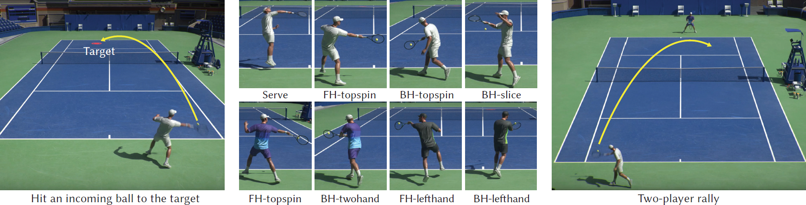
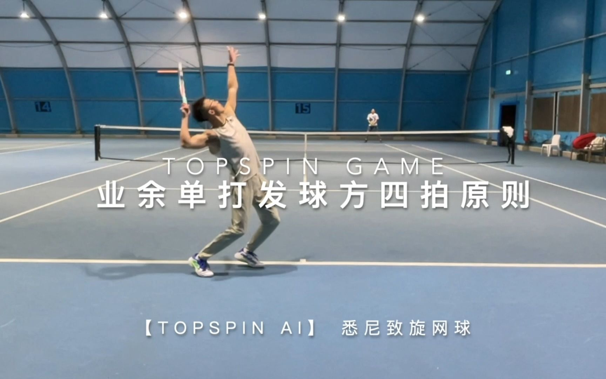
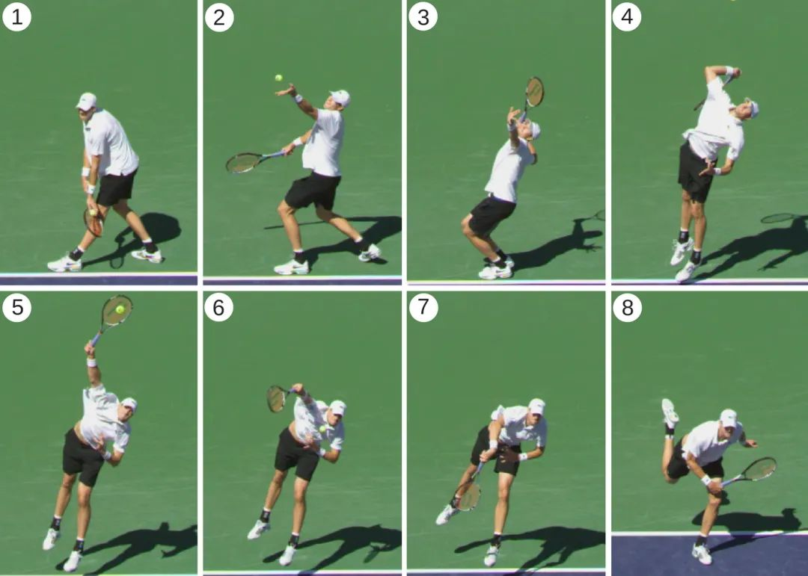
